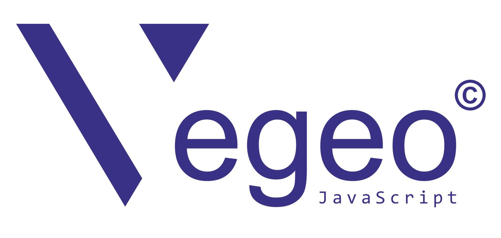

 
Copyright © 2019 by Gordan Šiber - All rights reserved 
mail to: info@vegeojs.com 
https://vegeojs.com/ 
___________________________________________________________ 

In the folder AGPLverison, you may find the website demo of vegeo, which is powered by simplified version of vegeo engine (vegeoSm-1.2.js) . 
You may also copy zip version for ready use on your computer.
___________________________________________________________  

<strong>Vegeo</strong> is a pure JavaScript engine that enables the creation of <strong>Progressive Web Application (PWA)</strong>, type of application which can be used as a web page as well as mobile app on any given device. This is a website design approach where each web page is generated through programming ability to dynamically retrieve selected data from the server (or once cached, from the memory cache).

For full demonstration of vegeo, please visit <a href="https://vegeojs.com/" title="vegeo home page"><strong>vegeo website</strong></a>
 

Main features of <strong>vegeo.js</strong>: 
<ul>
<li>The creation of blazing fast websites.</li>
<li>An agile and fluid user experience without any additional framework dependencies. The improvement in the user experience will bring the customer an app-like feel, bridging the gap between a native app and a conventional mobile website.</li>
<li>	ability to be installed and used as a mobile application.</li>
<li>Fewer requests to the server or to the computer memory cache.</li>
<li><strong>Vegeo as a green solution</strong>  - Increased website speed and fewer requests result in less energy consumption on the side of the server or any computer device (mobile, tablet, laptop, desktop).</li>
</ul>
